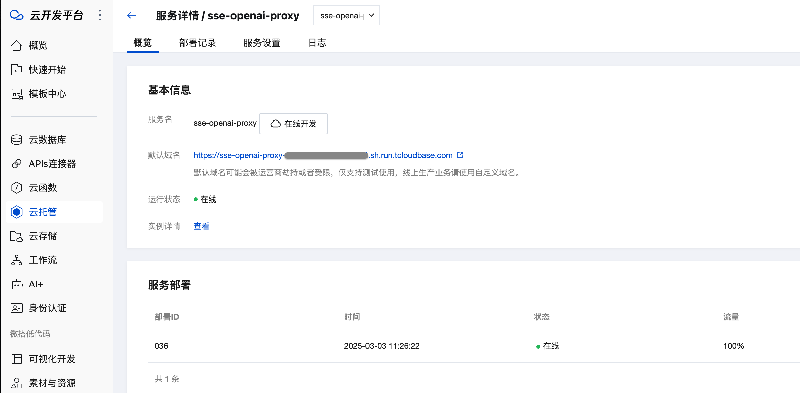
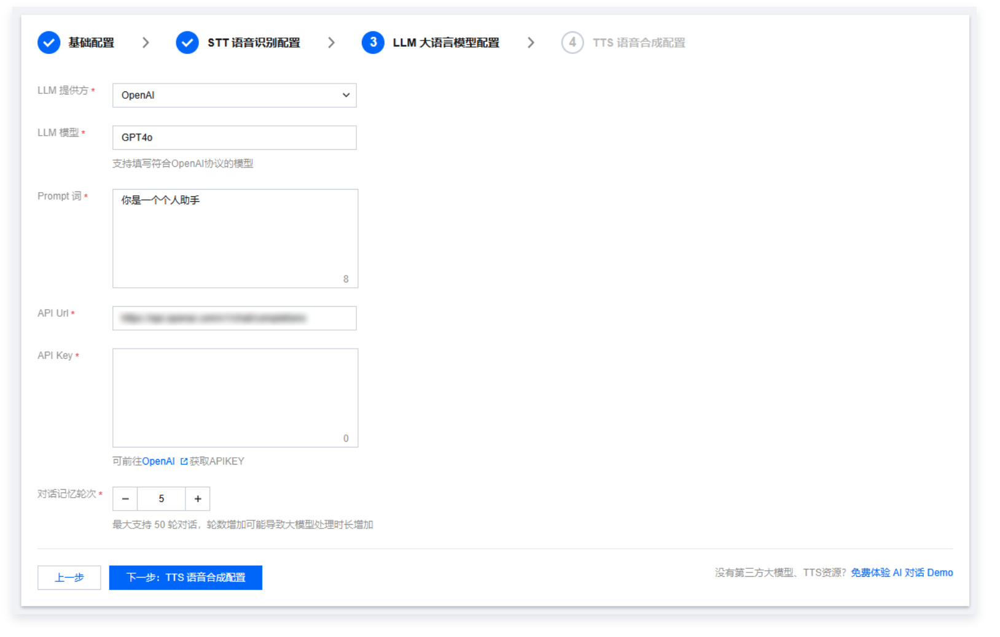

# LLM Services For Conversational AI CloudBase 

实现了几个专门用于处理 LLM (Large Language Model) 请求的云函数2.0服务，帮助快速接入TRTC-AI对话，每个服务都有其特定的功能和用途。

## 服务概述

### 1. LLM Context Manager
基础的 LLM 对话服务 (`cloudrunfunctions/llm-context-manager/index.mjs`)，提供以下核心功能：
- 基本的对话上下文管理
- 支持流式响应（SSE）
- 对话历史记录的存储和清理
- 可配置的上下文消息数量限制
- 支持自定义系统提示词

### 2. LLM Fast Reply
快速响应服务 (`cloudrunfunctions/llm-fast-reply/index.mjs`)，在标准 LLM 服务基础上增加了渐进式响应功能：
- 支持小模型快速预响应
- 使用较小的模型生成初步回复
- 同时启动大模型生成完整回复
- 可配置是否启用渐进式响应
- 支持自定义小模型参数（温度、最大 token 等）

### 3. LLM Tools
集成了工具调用功能的 LLM 服务 (`cloudrunfunctions/llm-tools/index.mjs`)：
- 支持天气查询功能
- 工具调用的自动处理和响应
- 支持多轮对话中的工具使用
- 工具调用结果的上下文整合

### 4. LLM RAG
实现了检索增强生成（RAG）功能的服务 (`cloudrunfunctions/llm-rag/index.mjs`)：
- 文档嵌入和存储
- 相似度检索
- 上下文增强
- 支持文档引用和溯源
- 可配置的相似度阈值和最大文档数


## 共同特性
所有服务都具备以下基础功能：
- 支持流式输出（SSE）
- 对话上下文管理
- 可配置的模型参数
- 错误处理和日志记录
- 支持自定义 API 端点和密钥
- 支持任务 ID 的会话隔离

## 配置项
主要配置参数包括：
- `LLM_BASE_URL`: API 基础 URL
- `LLM_API_KEY`: API 访问密钥
- `LLM_MODEL`: 默认使用的模型
- `MAX_CONTEXT_MESSAGES`: 上下文最大消息数
- `CONTEXT_EXPIRY_HOURS`: 上下文过期时间

## 使用说明
每个服务都通过 HTTP 请求调用，支持以下参数：
- `messages`: 对话消息数组
- `model`: 可选的模型指定
- `taskId`: 会话标识符
- 特定服务的额外参数（如 RAG 的相似度阈值等）

响应通过 Server-Sent Events (SSE) 流式返回，客户端需要相应处理流式数据。

注意：运行服务前请确保已正确配置环境变量，特别是 `LLM_API_KEY` 和 `LLM_BASE_URL`。


## 对接TRTC-AI对话
部署云函数2.0后，每个函数都会提供一个访问入口：**默认域名**，将默认域名填入到TRTC-AI对话的Playground中, 即刻开启AI对话， 具体操作方式如下。



### Playground 接入
在大模型接入的配置框中，将CloudBase部署云函数提供的url填入即可使用。

1. 首先进入配置页：https://console.cloud.tencent.com/trtc/conversational-ai

2. STT语音识别配置参考：https://cloud.tencent.com/document/product/647/116056#a9bf6945-84d1-477b-bd88-7ddee15e601f

3. LLM 配置
将部署后的云函数2.0生成的的**默认域名**复制到下图的 API Url 框内
如：https://sse-openai-proxy-xxxxx-x-xxxx.sh.run.tcloudbase.com/chat/completions

参考：https://cloud.tencent.com/document/product/647/116056#2d3404be-252f-4a04-9660-1685ca9e36a1

4. TTS 配置项参考： https://cloud.tencent.com/document/product/647/116056#68abd704-2c53-4c0b-be37-1a63c79d531e


### API 调用
部署云函数2.0后，每个函数都会提供一个访问入口：**默认域名**，将默认域名填入到TRTC-AI对话的Playground中, 即刻开启AI对话， 具体操作方式如下。


在调用启动AI对话接口时（[StartAIConversation](https://cloud.tencent.com/document/api/647/108514)）时，可以将CloudBase部署云函数提供的**默认域名**填到LLMConfig.APIUrl参数中，即可使用LLM服务进行对话。

```json
{
  "LLMType": "openai",  
  "Model":"xx",
  "APIKey":"xx",
  "APIUrl":"https://sse-openai-proxy-xxxxx-x-xxxx.sh.run.tcloudbase.com/chat/completions",
  "Streaming": true
}
```
